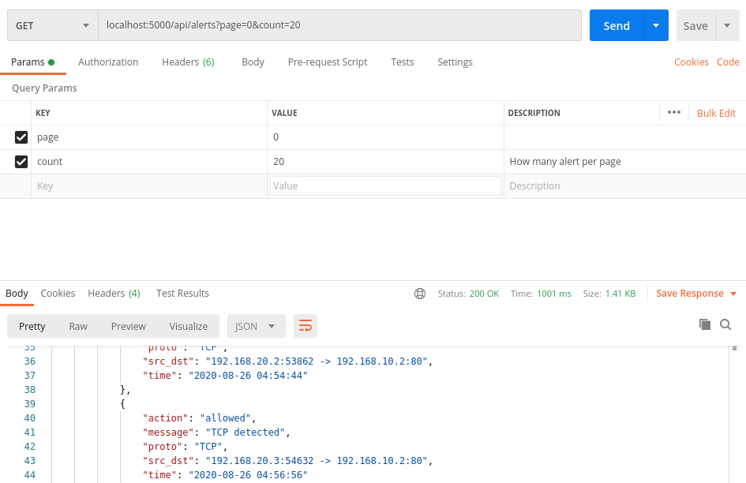
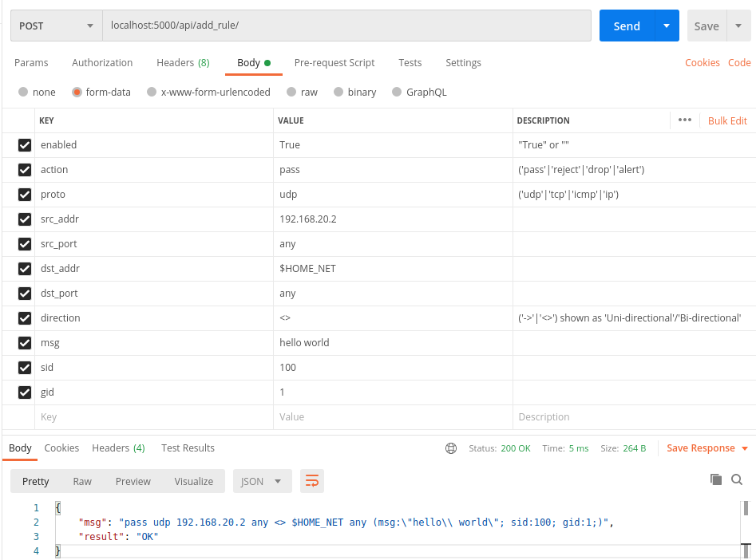

# Suricata Controller

### How to run

	sudo chmod u+x ./main.py
	sudo ./main.py

The program will show the web interface address (default 127.0.0.1:5000).
You can open the address from web browser to access the page.

To check if the Suricata is running, use:

	ps ax | grep suricata

List of pages:
 - /home/

List of api link:
 - /api/run\_log/
 - /api/alerts/
 - /api/clear\_log/
 - /api/stats/
 - /api/rules/
 - /api/add\_rule/

URL query parameter to access alerts:


Form to access add\_rule:


All pages other than home returns json data.

In case you accessing the /alert/clear\_log. Your eve.json and fast.log
file will be emptied. I have prepared sample page for eve.json and fast.log
in sample\_file folder.

# Frontend Webpack Compile

1. Install npm on your machine.
2. ```npm install``` at the folder
3. ```npm run start``` to watch frontend file change. 
4. ```npm run dev``` build for development.
5. ```npm run build``` build for production.
5. Run Suricata Server ```sudo ./backend/main.py```
